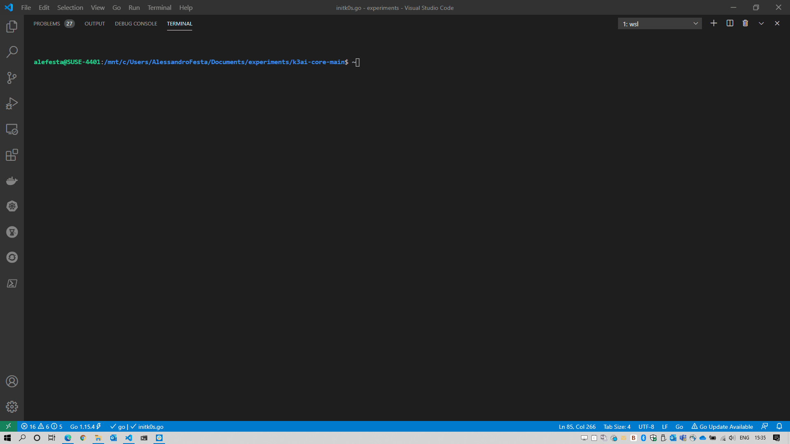

# K3ai \(keɪ3ai\)

K3ai is a lightweight infrastructure-in-a-box specifically built to install and configure AI tools and platforms to quickly experiment and/or run in production over edge devices.



## Ready to experiment?

We have a  utility script for you 

```text
curl -sfL https://get-core.k3ai.in | bash -
```

If for any reason it fails just go straight away to [https://github.com/kf5i/k3ai-core/releases](https://github.com/kf5i/k3ai-core/releases) and download the binary. Place it in your path and that's it.

 or use the following

```bash
#Set a variable to grab latest version
Version=$(curl -s "https://api.github.com/repos/kf5i/k3ai-core/releases/latest" | awk -F '"' '/tag_name/{print $4}' | cut -c 2-6) 
# get the binaries
wget https://github.com/kf5i/k3ai-core/releases/download/v$Version/k3ai-core_${Version}_linux_amd64.tar.gz
```

Looking for more interaction? join our Slack channel [**here**](https://join.slack.com/t/k3ai/shared_invite/zt-j61vfvkx-tCD~k9l2218lu7ZplRLGNA)\*\*\*\*

## Components of K3ai

Currently, we install the following components \(the list is changing and growing\):

* Kubernetes based on K3s from Rancher: [https://k3s.io/](https://k3s.io/)
* Kubernetes based on K0s from Mirantis: https://k0sproject.io
* Kubernetes KinD: [https://kind.sigs.k8s.io/](https://kind.sigs.k8s.io/)
* Kubeflow pipelines: [https://github.com/kubeflow/pipelines](https://github.com/kubeflow/pipelines)
* Argo Workflows: [https://github.com/argoproj/argo](https://github.com/argoproj/argo)
* H2O Community: https://h20.ai
* Kubeflow: [https://www.kubeflow.org/](https://www.kubeflow.org/) - **\(coming soon\)**
* NVIDIA GPU support: [https://docs.nvidia.com/datacenter/cloud-native/index.html](https://docs.nvidia.com/datacenter/cloud-native/index.html)
* NVIDIA Triton inference server: [https://github.com/triton-inference-server/server/tree/master/deploy/single\_server](https://github.com/triton-inference-server/server/tree/master/deploy/single_server) **\(coming soon\)**
* Tensorflow Serving: [https://www.tensorflow.org/tfx/serving/serving\_kubernetes](https://www.tensorflow.org/tfx/serving/serving_kubernetes):
  * ResNet
  * Mnist **\(coming soon\)**
* and many many others...

