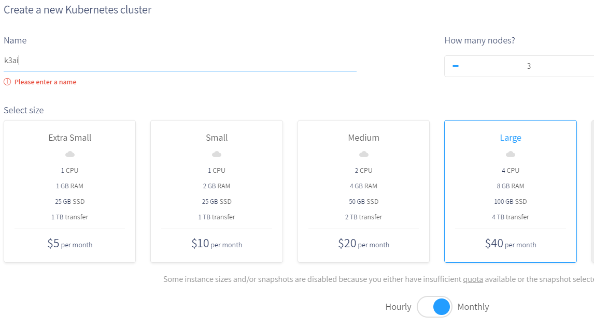
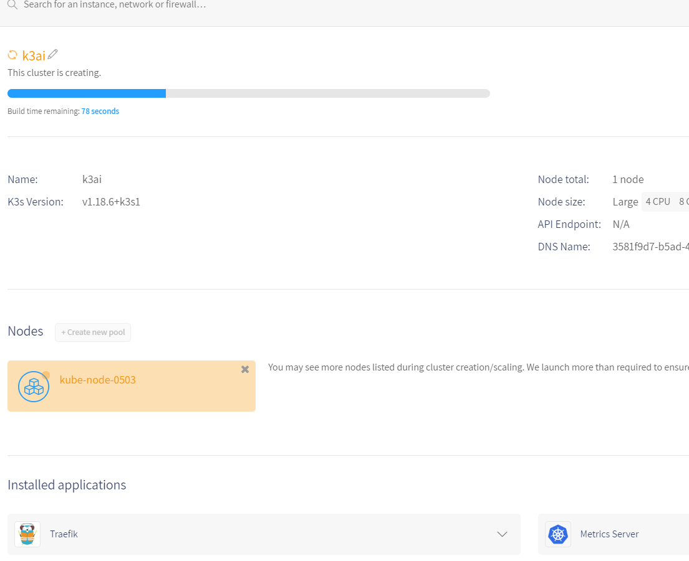

# Civo Cloud

[In 2019 we went all in and took Civo in a new direction](https://www.civo.com/blog/a-civo-2019-retrospective-how-we-got-here-and-what-s-next), launching the world’s first k3s-powered, managed Kubernetes service into beta.

As easy as can be, K3ai works perfectly on Civo. Here it is the **simplest guide ever** to run k3ai on Civo - three steps and your k3ai is ready!

## Installing k3ai on Civo

Ready? It requires less than 5 minutes!

You'll need an account on Civo.com. To do so simply register on Civo here:

[**https://www.civo.com/signup**](https://www.civo.com/signup)\*\*\*\*

## Step 1

Launch your k3s cluster using the default options \(Traefik and Metric-server selected\)



Wait for the instance to finish the deployment



## Step 2

Download the **kubeconfig** file, move it to your preferred location, and set your environment to use it:

```bash
kubectl config --kubeconfig="civo-k3ai-kubeconfig"
```

## Step 3

One last thing and then we're done:

```bash
 curl -sfL https://get.k3ai.in | bash -s - --skipk3s --plugin_civo_kfpipelines
```

enjoy your k3ai on[ **https://civo.com**](https://civo.com)\*\*\*\*

