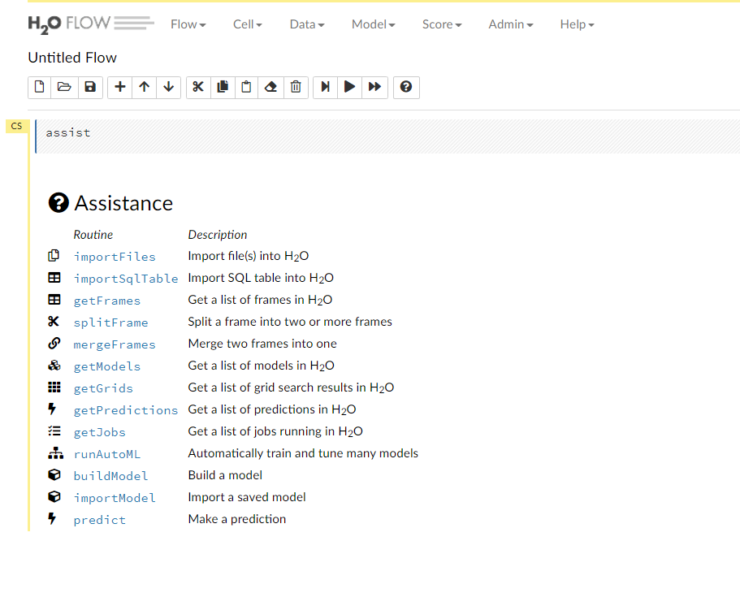

# H2O

> H2O is an open source, in-memory, distributed, fast, and scalable machine learning and predictive analytics platform that allows you to build machine learning models on big data and provides easy productionalization of those models in an enterprise environment. - [http://docs.h2o.ai/h2o/latest-stable/h2o-docs/welcome.html](http://docs.h2o.ai/h2o/latest-stable/h2o-docs/welcome.html)

In order to install H2O simply type:

```text
k3ai-cli apply h2o-single
```

This will deploy a single node instance of the h2o platform.

You may monitor the status of the pod with:

```bash
kubectl get pod -n h2o

#Output should be similar to this
NAME                 READY   STATUS    RESTARTS   AGE
h2o-stateful-set-0   1/1     Running   0          2m19s
```

To access it type:

```text
 kubectl port-forward -n h2o svc/h2o-service 54321:54321
```

Point your browser to either localhost or your cluster ip \(i.e.: http://localhost:54321\) you should see something like this



