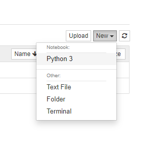

# Kubeflow SDK library

To help K3ai users to interact with Kubeflow we are introducing the support of Kubeflow SDK library \(kfp\).

> The [Kubeflow Pipelines SDK](https://kubeflow-pipelines.readthedocs.io/en/latest/source/kfp.html) provides a set of Python packages that you can use to specify and run your machine learning \(ML\) workflows. A _pipeline_ is a description of an ML workflow, including all of the _components_ that make up the steps in the workflow and how the components interact with each other - [**https://www.kubeflow.org/docs/pipelines/sdk/sdk-overview/**](https://www.kubeflow.org/docs/pipelines/sdk/sdk-overview/)\*\*\*\*

We offer two different way to consume kfp within k3ai:

* by  a virtual environment on the local computer of the user
* by  one of our Jupyter notebooks directly within k3ai

## KFP with VirtualEnv

> `virtualenv` is a tool to create isolated Python environments. Since Python `3.3`, a subset of it has been integrated into the standard library under the [`venv module`](https://docs.python.org/3/library/venv.html). -[https://virtualenv.pypa.io/en/latest/](https://virtualenv.pypa.io/en/latest/)

### Step 1

Please check you have `virtualenv` installed on your machine. Depending on the OS you are using you may use different approaches. Please follow the official guides to install `virtualenv` at [**https://virtualenv.pypa.io/en/latest/installation.html**](https://virtualenv.pypa.io/en/latest/installation.html)\*\*\*\*

### **Step 2**

Run the following command:

```text
curl -sfL https://get.k3ai.in | bash -s -- --cpu --plugin_kfp_sdk
```

Once the installer has finished please proceed to the "How to use KFP SDK" section.

## KFP within K3ai environment

We leverage Jupyter Notebooks to provide a pre-installed kfp environment so that one may immediately experiment with this.

```text
curl -sfL https://get.k3ai.in | bash -s --  --cpu --pipelines --plugin_jupyter-minimal
```

If you are using **WSL**

```text
curl -sfL https://get.k3ai.in | bash -s --  --wsl --pipelines --plugin_jupyter-minimal
```

If you already deployed the pipelines simply run:

```text
curl -sfL https://get.k3ai.in | bash -s -- --skipk3s --plugin_jupyter-minimal
```

Once the installer has finished please proceed to the "How to use KFP SDK" section.

## How to use KFP SDK

We present here a simple example to explain how the KFP SDK may be used. More examples may be found at [**https://www.kubeflow.org/docs/pipelines/tutorials/sdk-examples/**](https://www.kubeflow.org/docs/pipelines/tutorials/sdk-examples/)\*\*\*\*

#### Testing KFP SDK from virtualenv

This procedure will require you the K3ai IP address in case you forgot it the simplest way to grab it is execute the following command:

```text
k3s kubectl get service/traefik -o jsonpath='{.status.loadBalancer.ingress[0].ip}' -n kube-system
```

In your terminal create a file called **demo.py**, use your favorite IDE to copy and paste the below example, and change it accordingly to your K3ai environment.

```text
import kfp
import json

# 'host' is your Kubeflow Pipelines API server's host address.

host="http://<K3AI IP>/"

# 'pipeline_name' is the name of the pipeline you want to list. We provide you
#  here a pre-set name to test immediately

pipeline_name = "[Demo] TFX - Iris classification pipeline"

client = kfp.Client(host)

# To filter on pipeline name, you can use a predicate indicating that the pipeline
# name is equal to the given name.
# A predicate includes 'key', 'op' and 'string_value' fields.
# The 'key' specifies the property you want to apply the filter to. For example,
# if you want to filter on the pipeline name, then 'key' is set to 'name' as
# shown below.
# The 'op' specifies the operator used in a predicate. The operator can be
# EQUALS, NOT_EQUALS, GREATER_THAN, etc. The complete list is at [filter.proto](https://github.com/kubeflow/pipelines/blob/master/backend/api/filter.proto#L32)
# When using the operator in a string-typed predicate, you need to use the
# corresponding integer value of the enum. For Example, you can use the integer
# value 1 to indicate EQUALS as shown below.
# The 'string_value' specifies the value you want to filter with.

filter = json.dumps({'predicates': [{'key': 'name', 'op': 1, 'string_value': '{}'.format(pipeline_name)}]})
pipelines = client.pipelines.list_pipelines(filter=filter)

# The pipeline with the given pipeline_name, if exists, is in pipelines.pipelines[0].

print (pipelines)
```

save the file and execute it with

```text
python demo.py
```

You should get a result like in the "Checking the results" section.

### Testing with Jupyter Notebooks

Open your Jupyter Notebook at the address provided during the plugin installation. If you forgot the ip you may retrieve it this way

```text
IP=$(kubectl get service/traefik -o jsonpath='{.status.loadBalancer.ingress[0].ip}' -n kube-system) \
&& echo "http://"$IP":8888"
```

Once the Notebook is open click on top right of the notebook to create a new ipython environment



In the first cell paste the following script

```text
import kfp
import json

# 'host' is your Kubeflow Pipelines API server's host address.

host="http://ml-pipeline-ui.kubeflow/"

# 'pipeline_name' is the name of the pipeline you want to list. We provide you
#  here a pre-set name to test immediately

pipeline_name = "[Demo] TFX - Iris classification pipeline"

client = kfp.Client(host)

# To filter on pipeline name, you can use a predicate indicating that the pipeline
# name is equal to the given name.
# A predicate includes 'key', 'op' and 'string_value' fields.
# The 'key' specifies the property you want to apply the filter to. For example,
# if you want to filter on the pipeline name, then 'key' is set to 'name' as
# shown below.
# The 'op' specifies the operator used in a predicate. The operator can be
# EQUALS, NOT_EQUALS, GREATER_THAN, etc. The complete list is at [filter.proto](https://github.com/kubeflow/pipelines/blob/master/backend/api/filter.proto#L32)
# When using the operator in a string-typed predicate, you need to use the
# corresponding integer value of the enum. For Example, you can use the integer
# value 1 to indicate EQUALS as shown below.
# The 'string_value' specifies the value you want to filter with.

filter = json.dumps({'predicates': [{'key': 'name', 'op': 1, 'string_value': '{}'.format(pipeline_name)}]})
pipelines = client.pipelines.list_pipelines(filter=filter)

# The pipeline with the given pipeline_name, if exists, is in pipelines.pipelines[0].

print (pipelines)
```

Pres CTRL+ENTER to execute the cell.

### Checking the results

If everything went well in both `virtualenv` and `jupyter notebooks` samples you should have a result similar to this:

```text
{'next_page_token': None,
 'pipelines': [{'created_at': datetime.datetime(2020, 10, 14, 13, 27, 18, tzinfo=tzlocal()),
                'default_version': {'code_source_url': None,
                                    'created_at': datetime.datetime(2020, 10, 14, 13, 27, 18, tzinfo=tzlocal()),
                                    'id': '8a53981e-7c3e-4897-8c75-26f710c20f7a',
                                    'name': '[Demo] TFX - Iris classification '
                                            'pipeline',
                                    'package_url': None,
                                    'parameters': [{'name': 'pipeline-root',
                                                    'value': 'gs://{{kfp-default-bucket}}/tfx_iris/{{workflow.uid}}'},
                                                   {'name': 'data-root',
                                                    'value': 'gs://ml-pipeline/sample-data/iris/data'},
                                                   {'name': 'module-file',
                                                    'value': '/tfx-src/tfx/examples/iris/iris_utils_native_keras.py'}],
                                    'resource_references': [{'key': {'id': '8a53981e-7c3e-4897-8c75-26f710c20f7a',
                                                                     'type': 'PIPELINE'},
                                                             'name': None,
                                                             'relationship': 'OWNER'}]},
                'description': '[source '
                               'code](https://github.com/kubeflow/pipelines/tree/c84f4da0f7b534e1884f6696f161dc1375206ec2/samples/core/iris). '
                               'Example pipeline that classifies Iris flower '
                               'subspecies and how to use native Keras within '
                               'TFX.',
                'error': None,
                'id': '8a53981e-7c3e-4897-8c75-26f710c20f7a',
                'name': '[Demo] TFX - Iris classification pipeline',
                'parameters': [{'name': 'pipeline-root',
                                'value': 'gs://{{kfp-default-bucket}}/tfx_iris/{{workflow.uid}}'},
                               {'name': 'data-root',
                                'value': 'gs://ml-pipeline/sample-data/iris/data'},
                               {'name': 'module-file',
                                'value': '/tfx-src/tfx/examples/iris/iris_utils_native_keras.py'}],
                'url': None}],
 'total_size': 1}
```

