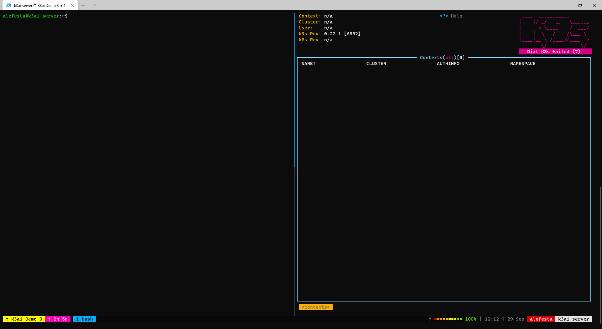

# Quick Start

## First things First

If you like we also have a documentation website here: [https://k3ai.gitbook.io/docs/](https://k3ai.gitbook.io/docs/)

Start by installing K3Ai with this:

```text
curl -sfL https://get.k3ai.in | bash -
```

### **Notes: sometimes things take longer than expected and you may see the error below:**

```text
error: timed out waiting for the condition on xxxxxxx
```

Don't worry about that sometimes the installation takes a few minutes especially the Vagrant one or if you have limited bandwidth.

Still curious how this looks like? Here's a short demo:



