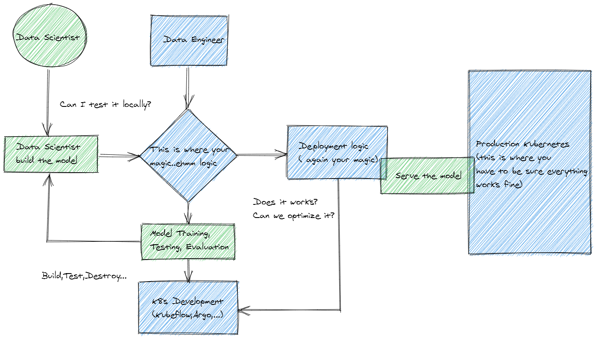

# What we are trying to solve \(a.k.a Our Goals\)

## Identify the problem

Artificial Intelligence platforms are complex. They combine a multitude of tools and frameworks that help Data Scientist and Data Engineers to solve the problem of building end-to-end pipelines.

But those AI platforms, by inheritance, have a degree of complexity. Let take at the use case of some of them:

> The end goal of every organization that utilizes machine learning \(ML\) is to have their ML models successfully run in production and generate value to the business. But what does it take to reach that point?
>
> Before a model ends up in production, there are potentially many steps required to build and deploy an ML model: data loading, verification, splitting, processing, feature engineering, model training and verification, hyperparameter tuning, and model serving.
>
> In addition, ML models can require more observation than traditional applications, because your data inputs can drift over time. Manually rebuilding models and data sets is time consuming and error prone.
>
> Kubeflow project - [https://www.kubeflow.org/docs/about/use-cases/](https://www.kubeflow.org/docs/about/use-cases/)

See the elephant in the room? We all have to struggle with the complexity of a process that looks like the one below

So here the first problem we identified \(yes I said first\): Remove the complexity and give you a straight solution.

Now there are plenty of alternatives when it comes to the infrastructure \(local infrastructure\) like:

* Minikube
* Kind
* Docker for Windows  \(Kubernetes\)
* MicroK8s

And some of them even allow you to install some platforms like Kubeflow but.. could you **cherry-picking** AI tools and/or solutions and running them on top of an infrastructure that does not suck up your entire laptop RAM? Let say you start from learning the basics of training a model on different platforms and later move to learn serving models. You won't have everything running but move from one configuration to the other quickly.

## Identify the other problem

If experimentation is one face of the coin the other is using K3ai in the context of CI/CD.

Data Engineers, DevOps or in a more fancy definition AIOps have to face the challenge of building infrastructure pipelines that satisfy the following requirements:

* Must be **FAST** to be built and **EASY** to be destroyed
* Must be **AVAILABLE** everywhere no matter if it's on-prem, on-cloud, or in the remote universe
* Must be  **REPRODUCIBLE** you want to be able to replicate the scenario again and again without having every time to re-configure things from scratch 

## Solving the problem

K3ai goal is to provide a micro-infrastructure that removes the complexity of the installation, configuration, and execution of any AI platform so that the user may focus on experimentation.

We want to satisfy the need for AI citizens and Corporate Scientists to be able to focus on what matters to them and forget the complexity attached to it.

To do so we have to satisfy a few requirements:

* **Everything we code has to be SIMPLE enough that anybody can contribute back**
* **Everything must live within ONE single command.** This way may easily be integrated within any automation script
* **Everything must be MODULAR.** We want to provide the greatest list of AI tools/solution ever so people may cherry-picking and create their own AI infrastructure combinations
* **We DO NOT install anything client-side \(aka we don't want to be invasive\)** if not the minimal tools needed to run the solution \(i.e.: k3s\)
* **We want to FAST**
* **We want to be LIGHTWEIGHT**

> K3ai is for the community by the community we want to be the reference to learn, grow for AI professionals, students and researchers.

